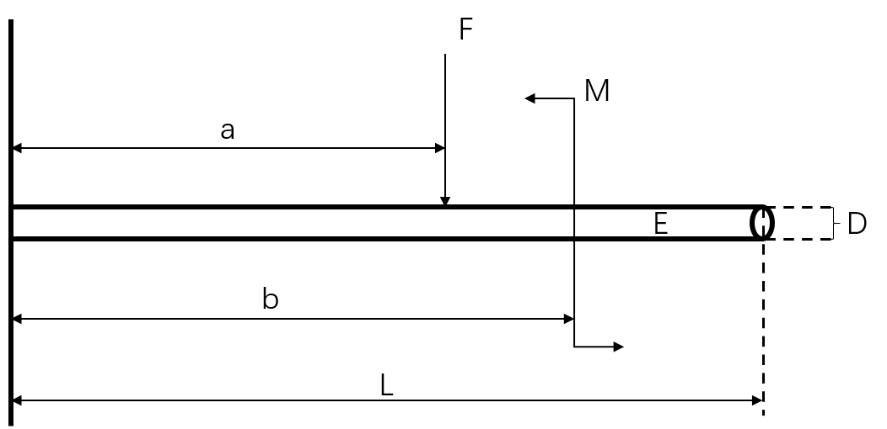

# 特定情况下的挠曲线计算及绘制
个人MATLAB大作业，在特定情况下计算并绘制梁弯曲的挠曲线。

## 问题提出
计算及绘制下图所示的悬臂梁的挠曲线方程及挠曲线。



其中：

- F——集中力大小。
- a——集中力作用点到固定端的距离。
- M——集中力偶矩大小。
- b——集中力偶矩作用点到固定端的距离。
- L——杆长。
- D——园杆直径。
- E——弹性模量。

## 问题分析

分析以上问题，本题可用叠加法求弯曲变形，受力分析可知挠曲线方程：

切向集中力单独作用下：


集中力偶矩单独作用下：


最后使用叠加法求出总挠度：


## 实验程序及解释

#### 需要使用者给定材料信息和受力情况，编写代码：
```matlab
disp('给定材料信息及受力情况');
L=input('园杆长度L(/m)=');
D=input('园杆直径D(/m)=');
E=input('弹性模量E(/GPa)=');
F=input('切向集中力大小【向下为正，若无取零】F(/N)=');
a=input('切向集中力作用位置a(/m)=');
M=input('集中力偶矩大小【逆时针为正，若无取零】M(/N*m)=');
b=input('集中力偶矩作用位置b(/m)=');
disp('给定计算精度');
n=input('计算精度=');
```

#### 对惯性矩进行计算：
```matlab
I=double(D^4*3.14/32);
```

#### 计算挠度，将上述数学公式写成MATLAB代码：
```matlab
%计算由集中力引起的挠度
x1=0:n:a;
vx1=(-F*x1.^2*3*a+F*x1.^3)*(1/(6*E*10^9*I));
x2=a:n:L;
vx2=(-F*a.^2*3*x2+F*a.^3)*(1/(6*E*10^9*I));
%计算由集中力偶引起的挠度
x3=0:n:b;
vx3=(-M*x3.^2)*(1/(2*E*10^9*I));
x4=b:n:L;
vx4=(-M*b*x4+M*0.5*b.^2)*(1/(E*10^9*I));
```

#### 连接挠度矩阵：
```matlab
v11=[vx1,vx2];
v22=[vx3,vx4];
```

#### 使用叠加法计算总挠度:
```matlab
v33=v22+v11;
```

#### 绘图：
```matlab
xu=[x1,x2];
plot(xu,v33),xlabel('x/m'),ylabel('v(x)/m')
title('挠曲线图')
grid on;
```

## 实验结果

#### 给定数据

- 园杆长度/m：3	

- 园杆直径/m：0.06

- 弹性模量/GPa：210	

- 切向集中力大小/N：4000

- 切向集中力作用位置/m：0.7	

- 集中力偶矩大小/N*m:250

- 集中力偶矩作用位置/m:0.4	

- 给定计算精度:0.001

#### 得挠曲线图像：


## 完整程序：
```matlab
% Deflection curve calculation and drawing
% (C)2021 SI-Xiaolong(ustb_stu_sixiaolong@outlook.com)
% MIT License(https://mit-license.org/)

%清理
clear all
clc

%给定信息
disp('给定材料信息及受力情况');
L=input('园杆长度L(/m)=');
D=input('园杆直径D(/m)=');
E=input('弹性模量E(/GPa)=');
F=input('切向集中力大小【向下为正，若无取零】F(/N)=');
a=input('切向集中力作用位置a(/m)=');
M=input('弯矩大小【逆时针为正，若无取零】M(/N*m)=');
b=input('弯矩作用位置b(/m)=');
disp('给定计算精度');
n=input('计算精度=');

%惯性矩计算
I=double(D^4*3.14/32);

%计算由集中力引起的挠度
x1=0:n:a;
vx1=(-F*x1.^2*3*a+F*x1.^3)*(1/(6*E*10^9*I));
x2=a:n:L;
vx2=(-F*a.^2*3*x2+F*a.^3)*(1/(6*E*10^9*I));
%计算由集中力偶引起的挠度
x3=0:n:b;
vx3=(-M*x3.^2)*(1/(2*E*10^9*I));
x4=b:n:L;
vx4=(-M*b*x4+M*0.5*b.^2)*(1/(E*10^9*I));

%连接矩阵
v11=[vx1,vx2];
v22=[vx3,vx4];

%采用叠加法计算总挠度
v33=v22+v11;

%绘图
xu=[x1,x2];
plot(xu,v33),xlabel('x/m'),ylabel('v(x)/m')
title('挠曲线图')
grid on;
```